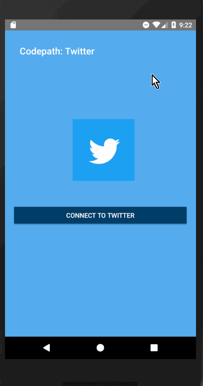

# Project 2 - *Twitter Client*

Twitter Client is an android app that allows a user to view his Twitter timeline. The app utilizes [Twitter REST API](https://dev.twitter.com/rest/public).

Time spent: 48 hours spent in total

## User Stories

The following **required** functionality is completed:

- [x] User can **sign in to Twitter** using OAuth login
- [x]	User can **view tweets from their home timeline**
  - [x] User is displayed the username, name, and body for each tweet
  - [] User is displayed the [relative timestamp](https://gist.github.com/nesquena/f786232f5ef72f6e10a7) for each tweet "8m", "7h"
- [x] User can refresh tweets timeline by pulling down to refresh

The following **optional** features are implemented:

- [x] User can view more tweets as they scroll with infinite pagination
- [ ] User can tap a tweet to display a "detailed" view of that tweet
- [ ] User can open the twitter app offline and see last loaded tweets
- [ ] On the Twitter timeline, leverage the CoordinatorLayout to apply scrolling behavior that hides / shows the toolbar.
- [x] Replace all icon drawables and other static image assets with [vector drawables](http://guides.codepath.org/android/Drawables#vector-drawables) where appropriate.
- [ ] User can see embedded image media within the tweet detail view
- [ ] User sees an **indeterminate progress indicator** when any background or network task is happening
- [ ] User can **see embedded image media within a tweet** on list or detail view.
- [x] User can **click a link within a tweet body** on tweet details view. The click will launch the web browser with relevant page opened.
- [ ] User can view following / followers list through any profile they view.
- [x] User is using **"Twitter branded" colors and styles**

The following **additional** features are implemented:

- [ ] List anything else that you can get done to improve the app functionality!

## Video Walkthrough

Here's a walkthrough of implemented user stories:

GIF created with [LiceCap](http://www.cockos.com/licecap/).

## Notes
Describe any challenges encountered while building the app.
- This project was more challenging. I did not have enough time throughout the week to implement the stretch stories. I know on 
part two I will implement even more and give myself time. 

## Open-source libraries used
- [Android Async HTTP](https://github.com/codepath/CPAsyncHttpClient) - Simple asynchronous HTTP requests with JSON parsing
- [Glide](https://github.com/bumptech/glide) - Image loading and caching library for Android